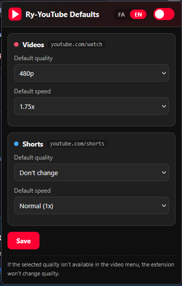

# YouTube Default Settings

> A browser extension that automatically applies your **default playback quality and speed** on YouTube — both for regular videos and Shorts. Works on **Google Chrome** and **Mozilla Firefox** from a single Manifest V3 package.

A lightweight add-on: every time you open a YouTube video, your preferred settings are applied automatically, so you no longer need to set the quality and speed manually.

The popup is **bilingual** (Persian / English), with **Persian as the default language**.

---

## Demo



---

## ✨ Features

- 🎚 **Default speed** — pick from ready-made values (0.25x to 2x) or enter a custom number (0.07 to 16).
- 🎞 **Default quality** — from 144p up to 4320p (8K), or Auto.
- 🧩 **Two independent setting sets** — one for `/watch`, one for `/shorts`.
- 🚫 **No fallback** — if the selected quality isn't present in the video's menu, the extension **does nothing** and leaves YouTube's current quality untouched (by design).
- 🌐 **Browser-language independent** — quality menu detection is based on the `p` suffix, not the word "Quality", so it works with any browser language.
- 🔄 **Reset-resistant** — if YouTube resets the speed to 1, it is reapplied automatically.
- 🌍 **Bilingual UI** — Persian (default) and English, switchable from the popup; your choice is remembered.
- ⚡ **No background script** — lighter and more compatible across browsers.

---

## 📦 Installation

This extension uses Manifest V3 and loads as "developer/unpacked" on both browsers **without any build step**.

### Google Chrome / Edge / Brave (and other Chromium browsers)

1. Clone or download this repository.
2. Open `chrome://extensions` in the address bar.
3. Turn on **Developer mode** in the top-right corner.
4. Click **Load unpacked** and select the project root folder (the one containing `manifest.json`).
5. The extension icon appears in the toolbar.

### Mozilla Firefox

1. Open `about:debugging#/runtime/this-firefox`.
2. Click **Load Temporary Add-on…**.
3. Select the `manifest.json` file in the project folder.
4. The extension stays active until you close the browser.

> 📝 **Permanent Firefox installation:** you must publish the add-on on [addons.mozilla.org](https://addons.mozilla.org) or sign it. Temporary installation is enough for development and personal use.

---

## 🚀 Usage

1. Click the extension icon in the toolbar to open the settings popup.
2. The **enable/disable** toggle at the top controls the whole extension.
3. In the **Videos** (`youtube.com/watch`) and **Shorts** (`youtube.com/shorts`) sections:
   - Choose a **default quality** (or "Don't change" to leave quality untouched).
   - Choose a **default speed** from the list, or pick "Custom…" and type a number.
4. Click **Save**. Settings are applied immediately to open tabs.
5. Go to YouTube and open a video or Short — your settings are applied automatically.

### Language

Use the **FA / EN** buttons in the top-right of the popup to switch the interface language. Persian is the default; your choice is persisted and restored on the next open.

### Important note about quality

> If the selected quality (e.g. `720p`) is **not available** in the player menu when a video opens, the extension **does nothing**. This is intentional: your quality is never changed without your consent, and the video simply plays at YouTube's own default quality.

---

## 🗂 Project structure

```
yt-video-default-quality-plugin/
├── manifest.json          # MV3 manifest (Chrome + Firefox)
├── content.js             # core logic: applies speed & quality to the player
├── popup.html             # popup UI (uses data-i18n attributes)
├── popup.css              # popup styles
├── popup.js               # popup logic: load/save settings + language wiring
├── i18n.js                # lightweight i18n helper (fa/en dictionary)
├── icons/
│   ├── icon16.png
│   ├── icon32.png
│   ├── icon48.png
│   └── icon128.png
├── tools/
│   └── gen-icons.js       # icon generator script (Node.js, no dependencies)
└── README.md
```

### Settings schema

Settings are stored in `chrome.storage.local`:

```json
{
  "enabled": true,
  "lang": "fa",
  "video":  { "quality": "720p",         "speed": "1.5" },
  "shorts": { "quality": "don't change", "speed": "1" }
}
```

| Field      | Values                                                              |
| ---------- | ------------------------------------------------------------------- |
| `enabled`  | `true` \| `false`                                                   |
| `lang`     | `"fa"` \| `"en"` (default: `"fa"`)                                 |
| `quality`  | `"don't change"` \| `"Auto"` \| `"144p"` … `"4320p"`               |
| `speed`    | numeric string between `"0.07"` and `"16"` (e.g. `"1.5"`, `"2"`)   |

---

## 🛠 How it works

The extension consists of a single **content script** on `youtube.com`:

1. **Page detection:** `location.pathname` determines whether the user is on `/watch` or `/shorts`, and the matching setting set is chosen.
2. **New-video detection:** because YouTube is a SPA, the `yt-navigate-finish` event and a `MutationObserver` on the `<video>` element are used to catch navigation between videos.
3. **Apply speed:** sets `video.playbackRate` and keeps it alive on `ratechange` events against YouTube's resets.
4. **Apply quality:**
   - Opens the player settings menu (gear button).
   - Finds the "Quality" item using a language-independent indicator (an item whose `.ytp-menuitem-content` ends with `p` or is `Auto`).
   - Enters the quality submenu and looks for the target option.
   - **If found** → clicks it. **If not found** → closes the menu and **does nothing**.

The **popup** uses `i18n.js`: a tiny dictionary-based helper. Elements with a `data-i18n` attribute are translated automatically; `data-i18n-title` and `data-i18n-placeholder` are supported too. The chosen language is persisted in storage under the `lang` key.

---

## 🧑‍💻 Development

### Prerequisites

- [Node.js](https://nodejs.org) (version 18 or later recommended) — only needed to regenerate icons.

### Regenerate icons

If you want to change the icon design, edit `tools/gen-icons.js` and run:

```bash
node tools/gen-icons.js
```

The script uses **no external dependencies** (only Node's standard `zlib` and `fs`) and produces `icons/icon16/32/48/128.png`.

### Development workflow

1. Make your changes.
2. In `chrome://extensions`, click **Reload** 🔄 on the extension card.
3. Open a YouTube tab and test the behavior (tip: DevTools → Console to check for errors).

### Debug tips

- Content script errors: in YouTube's DevTools, look at the **Console** tab (filter by extension content).
- Popup errors: right-click the popup → **Inspect**.
- To inspect stored values: run `chrome.storage.local.get(null, console.log)` in the extension's console.

---

## 🌍 Adding / editing translations

All UI strings live in the `DICT` object inside `i18n.js`, under the `fa` and `en` keys. To add a language:

1. Add a new key (e.g. `"es"`) to `SUPPORTED` and to `DICT` with all the entries.
2. Add a button in `popup.html` (next to the existing FA/EN buttons) with `data-lang="es"`.
3. Wire it in `popup.js` like the existing `langFa`/`langEn` buttons.

No build step, no bundler — just edit the dictionary.

---

## 🤝 Contributing

Contributions are welcome! 🎉

### Ways to contribute

- 🐛 **Bug reports** — if you see unexpected behavior, open an Issue with steps to reproduce.
- 💡 **Feature requests** — propose new ideas via an Issue.
- 🔧 **Pull requests** — improve the code or add a feature.

### Pull request guidelines

1. Open an Issue first to discuss larger changes.
2. Use a separate branch: `git checkout -b feature/your-feature`.
3. Keep the code clean and readable; follow the existing style.
4. If you change the icons, regenerate them with `node tools/gen-icons.js`.
5. Write clear descriptions (English or Persian).

### Good first issues

- Support embed pages (`youtube.com/embed/...`).
- Add a "max available quality" option.
- Full localization (i18n) of more strings.
- Official release on the Chrome Web Store and AMO.

---

## ⚠️ Limitations & caveats

- **YouTube DOM changes:** YouTube updates its UI frequently. If quality application stops working, the CSS selectors (such as `.ytp-settings-button`) likely changed and need updating.
- **Unavailable qualities:** some videos don't support higher qualities; in that case the extension does nothing (by design).
- **Temporary Firefox install:** a temporary add-on is removed when the browser closes.

---

## 📜 License

This project is released freely for public use. You may use, modify and redistribute it freely. Attribution is appreciated but not required.

---

Made with ❤️ for those who want to watch YouTube with their own default settings.
